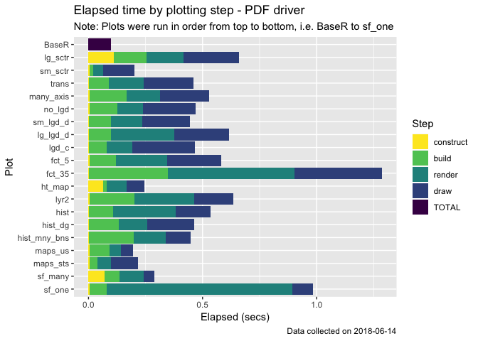
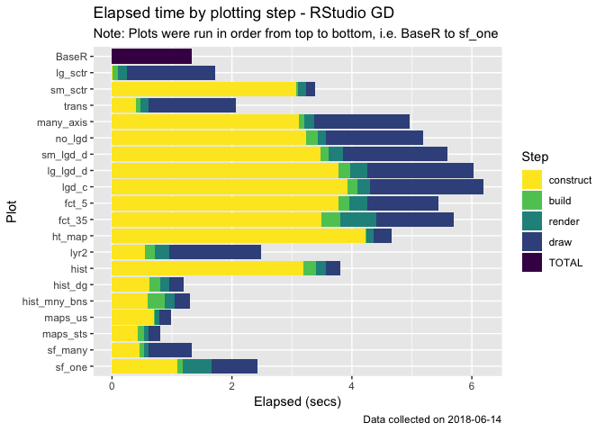

Profiling ggplot2 - highlighted results
================

Notable results
===============

-   The addition of a loess smoother is an outlier, increasing the time to plot &gt;25sec. This is likely a GAM issue, not caused by the simple addition of a 3rd layer in ggplot. Adding a second layer is no slower than simply plotting the 50K scatter plot. *Each of the following plots omit this plot for this reason*.
-   Surprisingly, one large sf\_polygon is slower to plot than 100 small sf\_polygons with geom\_sf
-   Heavy facetting increases processing time of build, render, and draw steps.
-   "Xlib" throws repeated warning: `In grid.Call.graphics(C_path, x$x, x$y, index, switch(x$rule,  ... :   Path drawing not available for this device` and fails to draw `geom_sf` and `geom_polygon` plots correctly. Affecting those measurements accordingly.

*For more verbose descriptions of the plots called, see description table at bottom of this file, or the plot calls in `ggprofile.R`*

Graphics Device matters
-----------------------

### PNG

### PDF Quartz

### RStudio GD

-   Even with the addition of a `grid.new()` call in `tidy_benchmark`, Rstudio GD seems to drag and affect the estimates of construct when combined with `map`
-   This `construct` inflation does not happen if you run each `tidy_benchplot` call individually and as such it's likely actually measuring the rgd doing its drawing from the previous plot.

### Plots Tested

| Plot Names     | Plot Description                               |
|:---------------|:-----------------------------------------------|
| BaseR          | BaseR - Scatterplot w/ 50k+ points             |
| lg\_sctr       | Scatterplot w/ 50k+ points                     |
| sm\_sctr       | Scatterplot w/1K points                        |
| trans          | Scatterplot w/ transformed scale               |
| many\_axis     | Scatterplot w/ many axis lables                |
| no\_lgd        | No Legend                                      |
| sm\_lgd\_d     | Small discrete legend (5 levels)               |
| lg\_lgd\_d     | Larger discrete legend (8 levels)              |
| lgd\_c         | Continuous legend                              |
| fct\_5         | Facetting Scatterplot - 5 facets               |
| fct\_35        | Facetting Scatterplot - 35 facets              |
| ht\_map        | Heat map with labels                           |
| lyr2           | 2 layers - scatter + geom\_smooth (lm)         |
| lyr3           | 3 layers - scatter + geom\_smooth (lm & loess) |
| hist           | histogram, position = stack                    |
| hist\_dg       | histogram, position = dodge                    |
| hist\_mny\_bns | histogram, many bins                           |
| maps\_us       | maps, geom\_polygon, usa                       |
| maps\_sts      | maps, geom\_polygon, states                    |
| sf\_many       | geom\_sf, 100 small polygons                   |
| sf\_one        | geom\_sf, one large multi-polygon              |
