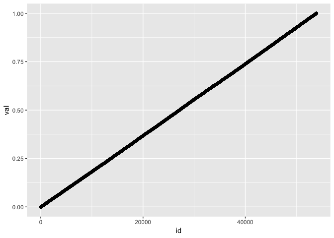
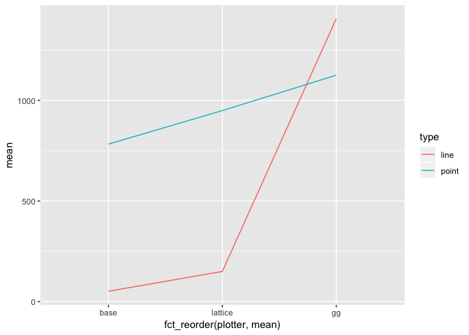
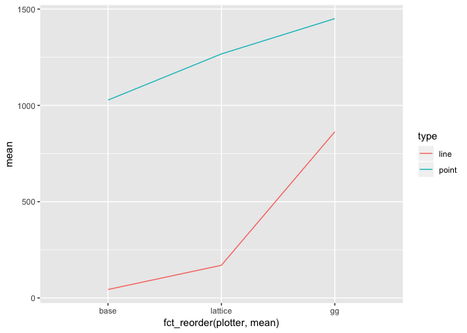
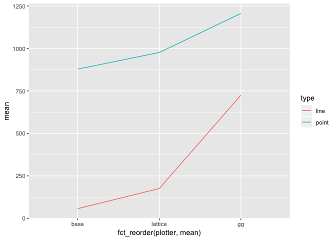

Line Plot
================
Tim Mastny
7/9/2018

``` r
library(tidyr)
library(forcats)

library(ggplot2)
library(lattice)
library(grid) 
library(microbenchmark)
```

``` r
line_point_bencher <- function(data, times = 5) {
  microbenchmark(
    gg_point = {
      png()
      p <- ggplot(data, aes(x = id, y = val)) + geom_point()
      print(p)
      dev.off()
    },
    gg_line = {
      png()
      p <- ggplot(data, aes(x = id, y = val)) + geom_path()
      print(p)
      dev.off()
    },
    base_point = {
      png()
      plot(data$id, data$val)
      dev.off()
    },
    base_line = {
      png()
      plot(data$id, data$val, type = 'l')
      dev.off()
    },
    lattice_point = {
      png()
      print(xyplot(val ~ id, data))
      dev.off()
    },
    lattice_line = {
      png()
      print(xyplot(val ~ id, data, type = 'l'))
      dev.off()
    }, times = times
  )
}

line_point_plotter <- function(data) {
  data %>%
    summary() %>%
    separate(expr, c("plotter", "type"), sep = "_") %>%
    ggplot() +
    geom_line(aes(fct_reorder(plotter, mean), mean, color = type, group = type))
}
```

# “Straight” Line Plot

This set of examples will look plots that a straight-ish. For example,

``` r
n <- nrow(diamonds)
dat <- function(x) { data.frame(id = 1:x, val = sort(runif(x))) }
ggplot(dat(n), aes(id, val)) + geom_point()
```

<!-- -->

### Smaller Plot

First, we will use 53940 points to plot, the number of points in the
diamond dataset.

``` r
plots <- line_point_bencher(dat(n))
plots
```

    ## Unit: milliseconds
    ##           expr        min         lq       mean     median         uq
    ##       gg_point  955.60169  960.10763 1125.17344  976.54919  997.81180
    ##        gg_line 1277.37230 1338.81342 1405.59149 1386.15056 1425.05862
    ##     base_point  659.12658  703.90283  782.73172  714.00272  756.40881
    ##      base_line   41.34096   41.63077   51.70979   44.23391   52.52717
    ##  lattice_point  798.69353  829.01949  949.21946  884.19736 1085.03006
    ##   lattice_line  122.88982  124.68733  150.31449  129.52496  164.15743
    ##         max neval
    ##  1735.79688     5
    ##  1600.56256     5
    ##  1080.21767     5
    ##    78.81612     5
    ##  1149.15685     5
    ##   210.31290     5

``` r
line_point_plotter(plots)
```

<!-- -->

### Larger Plot

``` r
n <- 86400
plots <- line_point_bencher(dat(n))
plots
```

    ## Unit: milliseconds
    ##           expr        min         lq       mean     median         uq
    ##       gg_point 1354.32326 1400.15816 1416.53312 1411.59363 1441.33522
    ##        gg_line 2339.60328 2345.06496 2375.27860 2378.45826 2380.96884
    ##     base_point 1013.67282 1014.59156 1028.20068 1016.85811 1026.04282
    ##      base_line   49.34238   50.11752   52.24116   51.28954   54.58945
    ##  lattice_point 1219.72859 1234.33703 1248.71904 1243.10479 1247.89119
    ##   lattice_line  152.44533  156.49358  173.21860  161.13870  171.57044
    ##         max neval
    ##  1475.25535     5
    ##  2432.29765     5
    ##  1069.83809     5
    ##    55.86691     5
    ##  1298.53358     5
    ##   224.44495     5

``` r
line_point_plotter(plots)
```

<!-- -->

# Diamonds Plot

Now let’s use the actual diamond data-set:

``` r
d <- data.frame(id = diamonds$carat, val = diamonds$price)
plots <- line_point_bencher(d)
plots
```

    ## Unit: milliseconds
    ##           expr       min        lq      mean    median        uq       max
    ##       gg_point 935.04004 937.06510 972.41199 971.03675 994.24027 1024.6778
    ##        gg_line 722.62502 762.66961 776.39035 768.17703 772.93910  855.5410
    ##     base_point 634.11219 642.84831 652.57211 652.07935 658.06431  675.7564
    ##      base_line  39.42502  43.54234  43.14345  43.76573  44.20875   44.7754
    ##  lattice_point 809.75045 813.28855 816.13405 814.75620 815.86490  827.0101
    ##   lattice_line 129.26945 130.19910 135.60444 132.49783 135.90373  150.1521
    ##  neval
    ##      5
    ##      5
    ##      5
    ##      5
    ##      5
    ##      5

``` r
line_point_plotter(plots)
```

<!-- -->
