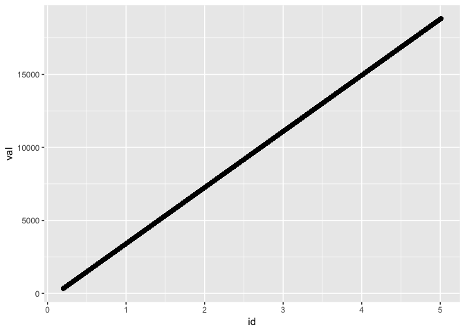
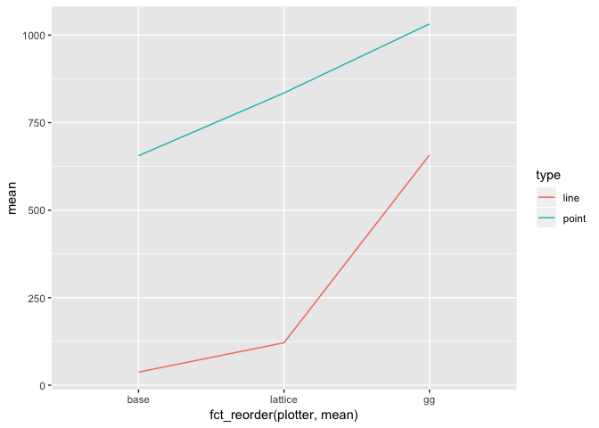
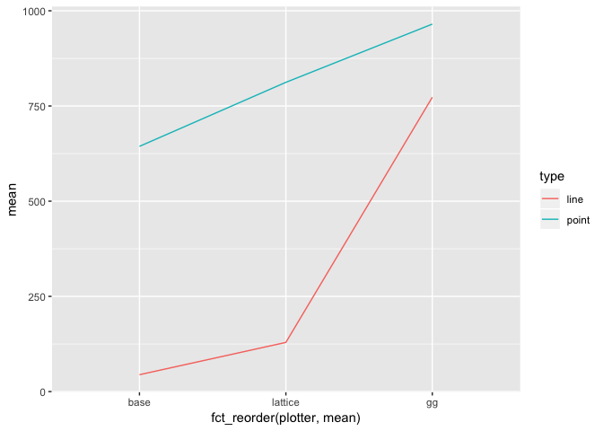

Line Plot
================
Tim Mastny
7/9/2018

``` r
library(tidyr)
library(forcats)

library(ggplot2)
library(lattice)
library(grid) 
library(microbenchmark)
```

``` r
line_point_bencher <- function(data, times = 5) {
  microbenchmark(
    gg_point = {
      png()
      p <- ggplot(data, aes(x = id, y = val)) + geom_point()
      print(p)
      dev.off()
    },
    gg_line = {
      png()
      p <- ggplot(data, aes(x = id, y = val)) + geom_line()
      print(p)
      dev.off()
    },
    base_point = {
      png()
      plot(data$id, data$val)
      dev.off()
    },
    base_line = {
      png()
      plot(data$id, data$val, type = 'l')
      dev.off()
    },
    lattice_point = {
      png()
      print(xyplot(val ~ id, data))
      dev.off()
    },
    lattice_line = {
      png()
      print(xyplot(val ~ id, data, type = 'l'))
      dev.off()
    }, times = times
  )
}

line_point_plotter <- function(data) {
  data %>%
    summary() %>%
    separate(expr, c("plotter", "type"), sep = "_") %>%
    ggplot() +
    geom_line(aes(fct_reorder(plotter, mean), mean, color = type, group = type))
}
```

# “Straight” Line Plot

This set of examples will look plots that a straight-ish. For example,

``` r
n <- nrow(diamonds)
dat <- function(x) { data.frame(id = 1:x, val = sort(runif(x))) }
ggplot(dat(n), aes(id, val)) + geom_point()
```

<!-- -->

### Smaller Plot

First, we will use 53940 points to plot, the number of points in the
diamond dataset.

``` r
plots <- line_point_bencher(dat(n))
plots
```

    ## Unit: milliseconds
    ##           expr        min        lq       mean     median         uq
    ##       gg_point 1067.10273 1134.5488 1211.86491 1182.22471 1257.71854
    ##        gg_line 1368.92391 1396.5177 1445.88414 1407.19722 1461.88547
    ##     base_point  679.48266  726.3549  803.41064  756.84045  924.22937
    ##      base_line   40.12563   45.8121   46.44267   47.38094   47.76422
    ##  lattice_point  931.18725  960.4839 1049.16388 1033.61636 1113.26422
    ##   lattice_line  148.57836  198.1019  194.54966  200.94890  212.19004
    ##         max neval
    ##  1417.72981     5
    ##  1594.89645     5
    ##   930.14580     5
    ##    51.13046     5
    ##  1207.26764     5
    ##   212.92908     5

``` r
line_point_plotter(plots)
```

<!-- -->

### Larger Plot

``` r
n <- 86400
plots <- line_point_bencher(dat(n))
plots
```

    ## Unit: milliseconds
    ##           expr        min         lq       mean     median         uq
    ##       gg_point 1921.47572 2096.92848 2135.63240 2130.36487 2229.59870
    ##        gg_line 2966.62471 2971.90800 3119.10305 3058.62106 3284.50726
    ##     base_point 1130.31465 1342.25678 1404.05437 1368.19646 1561.37031
    ##      base_line   56.07836   58.37571   61.02756   58.68757   62.43244
    ##  lattice_point 1584.59264 1586.92679 1793.71594 1863.95901 1936.69198
    ##   lattice_line  188.89123  205.94485  260.07433  229.39967  336.29934
    ##         max neval
    ##  2299.79421     5
    ##  3313.85424     5
    ##  1618.13363     5
    ##    69.56374     5
    ##  1996.40929     5
    ##   339.83656     5

``` r
line_point_plotter(plots)
```

<!-- -->

# Diamonds Plot

Now let’s use the actual diamond data-set:

``` r
d <- data.frame(id = diamonds$carat, val = diamonds$price)
plots <- line_point_bencher(d)
plots
```

    ## Unit: milliseconds
    ##           expr        min         lq       mean     median         uq
    ##       gg_point 1048.70611 1071.54328 1206.07666 1208.57124 1304.10824
    ##        gg_line  601.31333  648.56034  724.70897  734.21683  801.27646
    ##     base_point  823.95110  841.11660  878.32085  864.68588  919.84401
    ##      base_line   46.25282   46.65643   57.11641   47.57448   68.78533
    ##  lattice_point  898.27852  916.28306  976.11856  952.62965 1055.09482
    ##   lattice_line  141.49604  146.08728  175.79878  170.55766  188.08395
    ##         max neval
    ##  1397.45441     5
    ##   838.17791     5
    ##   942.00665     5
    ##    76.31298     5
    ##  1058.30675     5
    ##   232.76897     5

``` r
line_point_plotter(plots)
```

<!-- -->
