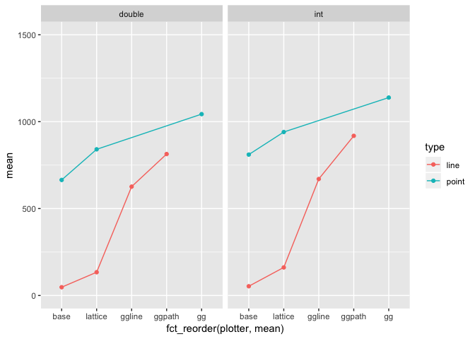

Line Plot
================
Tim Mastny
7/9/2018

``` r
library(tidyr)
library(forcats)
library(dplyr)
```

    ## Warning: package 'dplyr' was built under R version 3.5.1

    ## 
    ## Attaching package: 'dplyr'

    ## The following objects are masked from 'package:stats':
    ## 
    ##     filter, lag

    ## The following objects are masked from 'package:base':
    ## 
    ##     intersect, setdiff, setequal, union

``` r
library(ggplot2)
library(lattice)
library(grid) 
library(microbenchmark)
```

``` r
line_point_bencher <- function(data, times = 5) {
  microbenchmark(
    gg_point = {
      png()
      p <- ggplot(data, aes(x = id, y = val)) + geom_point()
      print(p)
      dev.off()
    },
    ggpath_line = {
      png()
      p <- ggplot(data, aes(x = id, y = val)) + geom_path()
      print(p)
      dev.off()
    },
    ggline_line = {
      png()
      p <- ggplot(data, aes(x = id, y = val)) + geom_line()
      print(p)
      dev.off()
    },
    base_point = {
      png()
      plot(data$id, data$val)
      dev.off()
    },
    base_line = {
      png()
      plot(data$id, data$val, type = 'l')
      dev.off()
    },
    lattice_point = {
      png()
      print(xyplot(val ~ id, data))
      dev.off()
    },
    lattice_line = {
      png()
      print(xyplot(val ~ id, data, type = 'l'))
      dev.off()
    }, times = times
  )
}

line_point_plotter <- function(data) {
  data %>%
    separate(expr, c("plotter", "type"), sep = "_") %>%
    ggplot(aes(fct_reorder(plotter, mean), mean, color = type, group = type)) +
    geom_line() + 
    geom_point()
}
```

# Plots

We’ll compare making line plots with this artifical straight dataset and
the `diamonds` dataset.

``` r
n <- nrow(diamonds)
dat <- function(x) { 
  data.frame(
    id = seq(min(diamonds$carat), max(diamonds$carat), length.out = x), 
    val = seq(min(diamonds$price), max(diamonds$price), length.out = x)
  ) 
}
ggplot(dat(n), aes(id, val)) + geom_point()
```

<!-- -->

``` r
ggplot(diamonds, aes(carat, price)) + geom_point()
```

<!-- -->

### Benchmarking

``` r
straight_small <- line_point_bencher(dat(n)) %>%
  summary() %>% 
  mutate(plot = "small") 
```

``` r
straight_large <- line_point_bencher(dat(n * 2)) %>%
  summary() %>%
  mutate(plot = "large")
```

``` r
d <- data.frame(id = diamonds$carat, val = as.numeric(diamonds$price))
diamond_plots <- line_point_bencher(d) %>% 
  summary() %>%
  mutate(plot = 'diamonds')
```

# Plots

``` r
bind_rows(straight_large, straight_small, diamond_plots) %>%
  mutate(plot = factor(plot, levels = c("diamonds", "small", "large"))) %>%
  line_point_plotter() +
  facet_wrap(~plot)
```

<!-- -->

# Integer Plots

Before, we’ve been intentionally plotting doubles. What happens when we
use integers?

### “Straight” Line Integers

``` r
n <- nrow(diamonds)
dat <- function(x) { 
  data.frame(
    id = 1:x, 
    val = seq(min(diamonds$price), max(diamonds$price), length.out = x)
  ) 
}
```

``` r
straight_small_ints <- line_point_bencher(dat(n)) %>%
  summary() %>%
  mutate(data = "int")

straight_small %>%
  mutate(data = "double") %>%
  bind_rows(straight_small_ints) %>%
  line_point_plotter() + 
  facet_wrap(~data) + 
  ylim(c(0, 1500)) 
```

<!-- -->

### Diamond Integers

``` r
d <- data.frame(id = diamonds$carat, val = diamonds$price)
diamond_plots_int <- line_point_bencher(d) %>%
  summary() %>%
  mutate(data = "int")
```

``` r
diamond_plots %>%
  mutate(data = "double") %>%
  bind_rows(diamond_plots_int) %>%
  line_point_plotter() + 
  facet_wrap(~data) + 
  ylim(c(0, 1500))
```

<!-- -->
