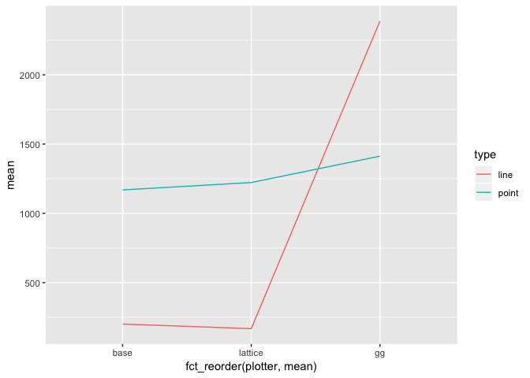

Plot Profiling
================
Tim Mastny, @tmastny
6/25/2018

``` r
library(ggplot2)
library(lattice)
library(grid) 
library(microbenchmark)
```

## Diamonds Scatterplot

``` r
plots <- microbenchmark(
  base = { 
    plot(price ~ carat, data = diamonds)
  },
  ggplot = {
    p <- ggplot(diamonds, aes(carat, price)) + geom_point(shape = 1)  
    grid.draw(ggplot_gtable(ggplot_build((p))))
  },
  lattice = {
    print(xyplot(price ~ carat, diamonds))
  }
)
```

``` r
plots
```

    ## Unit: milliseconds
    ##     expr      min       lq     mean   median        uq      max neval
    ##     base 682.1121 722.9768 786.9027 744.5284  820.8554 1259.816   100
    ##   ggplot 834.8694 908.4209 999.4146 952.8623 1039.6550 1546.227   100
    ##  lattice 730.1598 770.0791 838.8669 807.5558  872.7631 1528.797   100

## Time in OS Graphics

`ggplot2`:

    1.33 (Tim)

`base`:

    1.41 (Tim)

# Line vs. Point

``` r
n <- 86400
dat <- data.frame(id = 1:n, val = sort(runif(n)))
```

``` r
plots <- microbenchmark(
  gg_point = grid.draw(ggplot_gtable(ggplot_build(ggplot(dat, aes(x = id, y = val)) + geom_point()))),
  gg_line = grid.draw(ggplot_gtable(ggplot_build(ggplot(dat, aes(x = id, y = val)) + geom_line()))),
  base_point = plot(val ~ id, data = dat),
  base_line = plot(val ~ id, data = dat, type = 'l'),
  lattice_point = print(xyplot(val ~ id, dat)),
  lattice_line = print(xyplot(val ~ id, dat, type = 'l'))
)
```

``` r
plots
```

    ## Unit: milliseconds
    ##           expr       min        lq      mean    median        uq       max
    ##       gg_point 1217.7409 1318.5538 1413.1941 1390.1023 1468.2949 2262.8500
    ##        gg_line 2050.1089 2223.8651 2387.6733 2349.0009 2544.5432 3239.4490
    ##     base_point 1085.5712 1123.2832 1169.3727 1151.6195 1194.7085 1544.8079
    ##      base_line  179.0975  188.7462  201.3399  197.1586  207.2519  292.5508
    ##  lattice_point 1121.5173 1172.3655 1222.6629 1205.7624 1255.0630 1728.4749
    ##   lattice_line  127.7422  146.9829  168.0802  161.8608  180.2621  289.9886
    ##  neval
    ##    100
    ##    100
    ##    100
    ##    100
    ##    100
    ##    100

``` r
library(tidyverse)
```

    ## ── Attaching packages ────────────────────────────────────────────────────────── tidyverse 1.2.1 ──

    ## ✔ tibble  1.4.2     ✔ purrr   0.2.5
    ## ✔ tidyr   0.8.1     ✔ dplyr   0.7.5
    ## ✔ readr   1.1.1     ✔ stringr 1.3.1
    ## ✔ tibble  1.4.2     ✔ forcats 0.3.0

    ## ── Conflicts ───────────────────────────────────────────────────────────── tidyverse_conflicts() ──
    ## ✖ dplyr::filter() masks stats::filter()
    ## ✖ dplyr::lag()    masks stats::lag()

``` r
plots %>%
  summary() %>%
  separate(expr, c("plotter", "type"), sep = "_") %>%
  ggplot() +
  geom_line(aes(fct_reorder(plotter, mean), mean, color = type, group = type))
```

<!-- -->

## Time in OS Graphics

`ggplot2`:

  - point

<!-- end list -->

    2.13

  - line

<!-- end list -->

    1.95

`base`:

  - point

<!-- end list -->

    2.16

  - line

<!-- end list -->

    1.37
